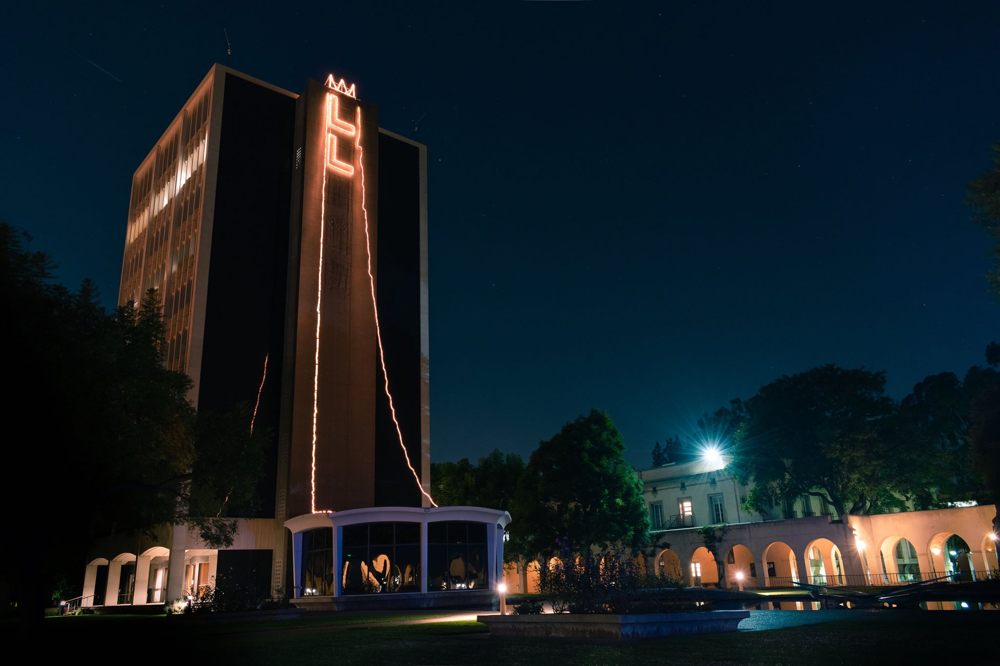

Andre Liu's photo of the Lloyd Christmas Tree is the January winner of the Big T's monthly photography contest. Congrats Andre!

===

Pasadena's year-long sunny weather and the pressing demands of Caltech courseloads can make it easy not to notice the holiday season approaching. It would be easy, that is, were it not for the Lloyd Christmas Tree. Every year like clockwork, Lloydies scale Millikan Library to put up the tree (or 'light cone,' maybe?). The tree usually reads "LLOYD," but this year technical difficulties left it with a lone pair of L's. The tree remains lit from a bit before Christmas through the first weeks of the new year. 

You will find Andre's photo in the opening or closing section of this year's book, _Make it So._ Happy new year, everyone!
