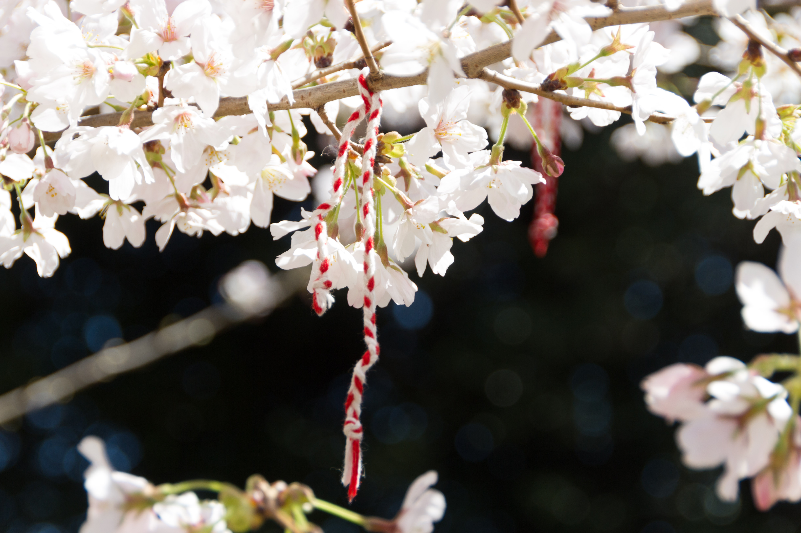
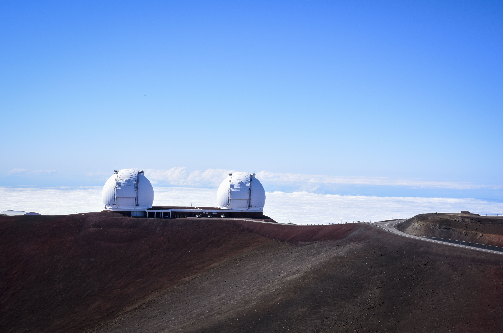

Congrats to the winners of our spring photo contest: Selina in the Caltech category and Chris and Elise in the non-Caltech category! 

===

In this special spring edition of our photo contest we ran two categories: Caltech related photos and a general category.

### Caltech Category

Yearbook loves plants! You don't have to head off campus to the Huntington for nice plants, however. Selina's picture of these light yellow flowers takes first place in the Caltech category!

Snow?? Not in Pasadena, but nearby Mammoth Lakes had the perfect location for Selina's perfectly balanced picture of Laurel Mountain and Convict Lake. 

### General Category

Yearbook really loves plants! This picture from Chris comes all the way from the other side of the States from Washington, DC's annual Cherry Blossom Festival.

Hawai'i is known for its beautiful scenery and volcanoes, and Elise's picture of the Keck observatory on Mauna Kea on a recent GPS trip does not disappoint. 

You will find these photos and more in the opening or closing section of this year's book, _Make it So_. Happy spring!